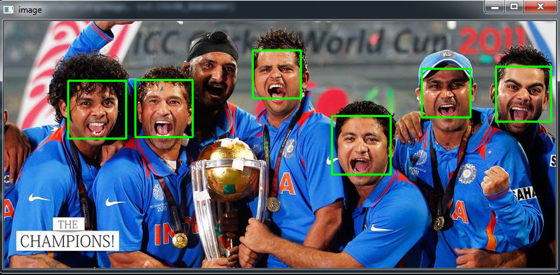

# Face detection 
    This is a face detection project using cv2 library done as practice while learning computer vision  

# Dependencies
    Opencv - computer vision library
    Viola-Jones classifier to detect object
    
# To run  

    upload the image to  images folder and change the name in line 10 and enter below the command to run

    python main.py

# Demo

    demo image

   

